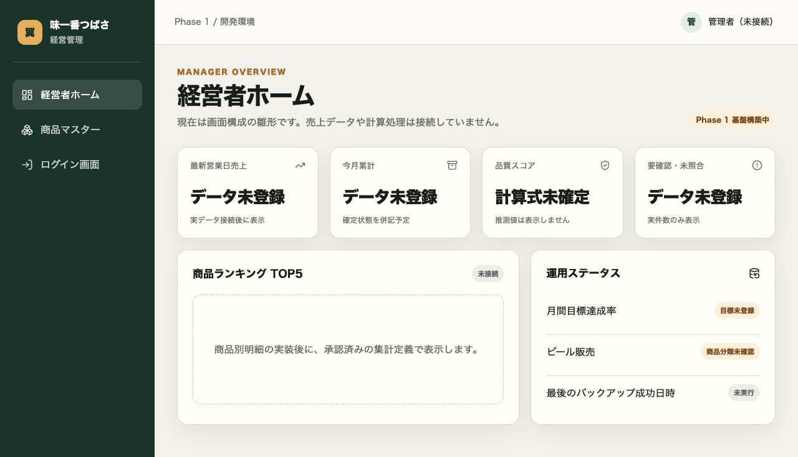
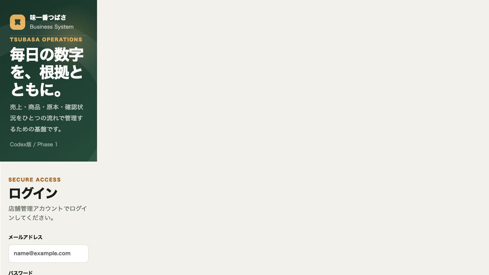
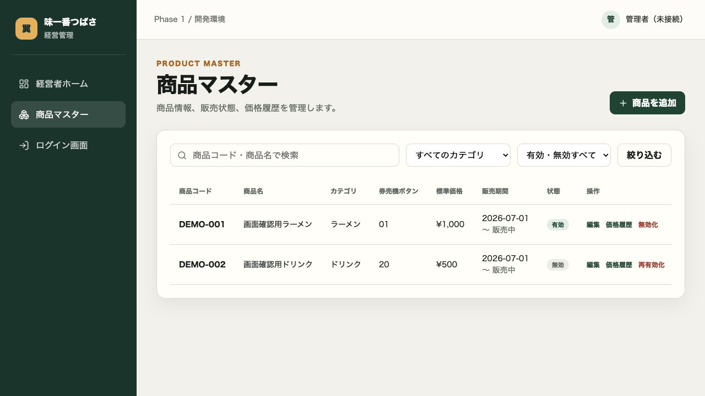
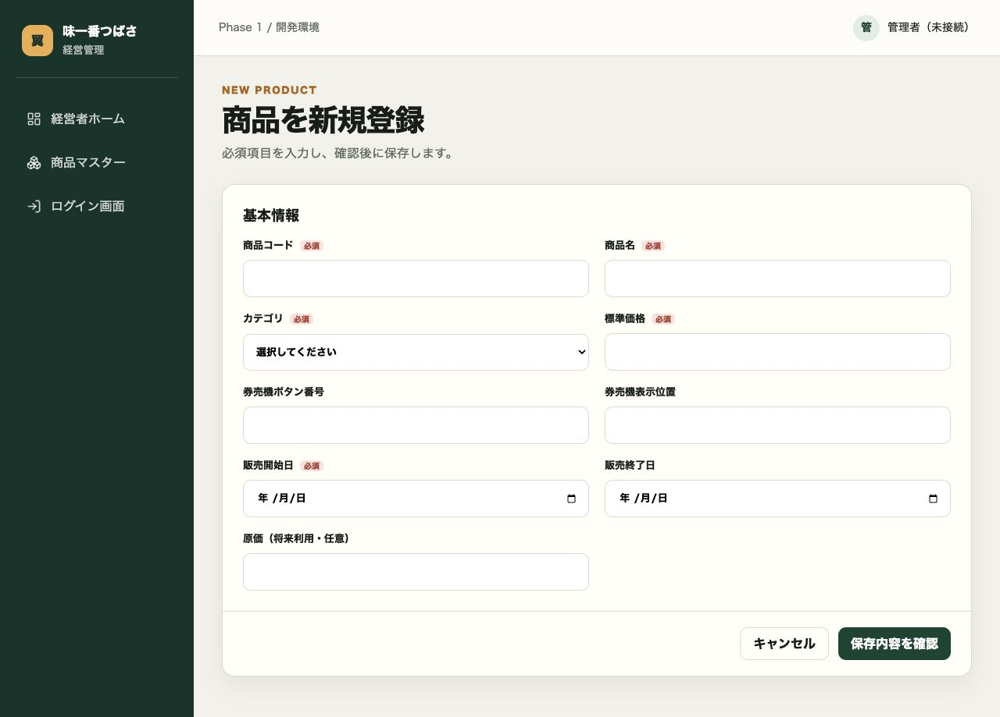
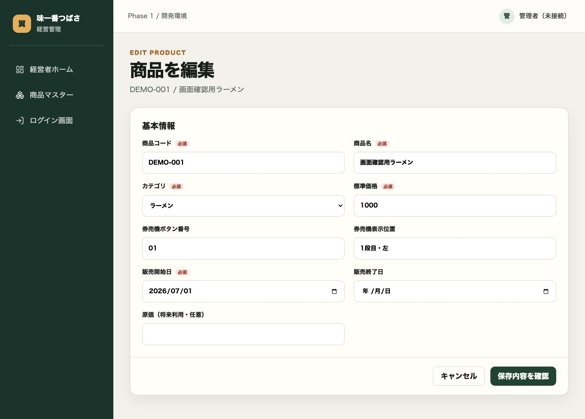
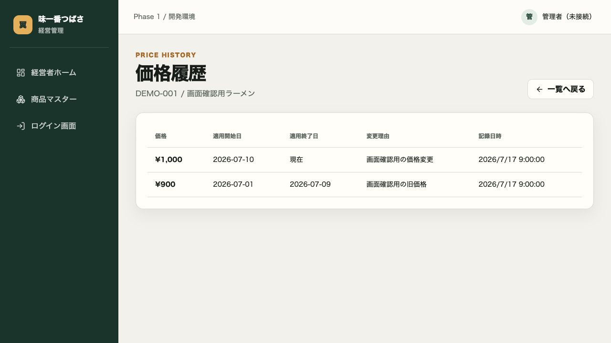
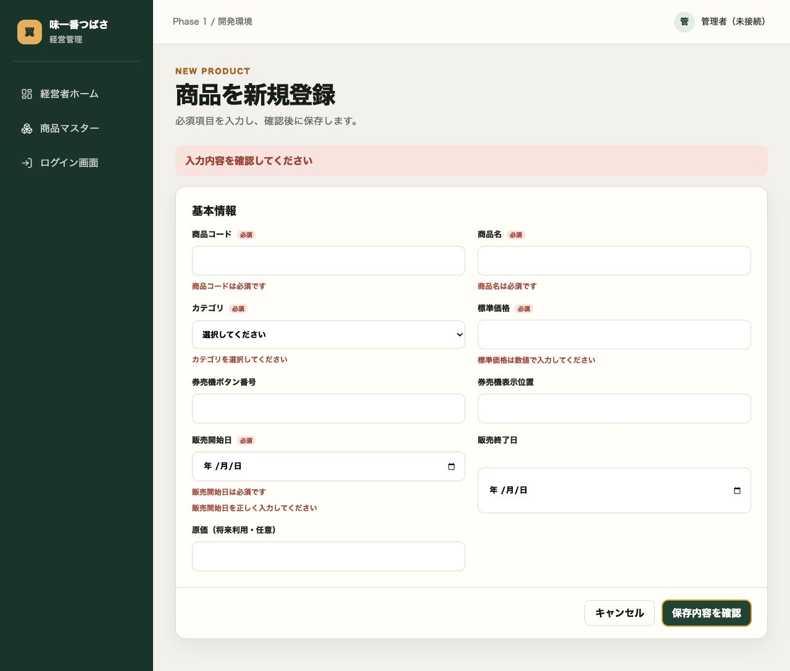
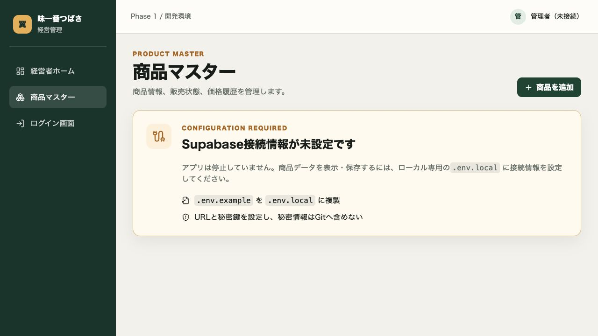

# 味一番つばさ 売上管理・経営分析システム「つばさ3」

## 現在の本番正本

- 公開Web版: https://infoworks-jp.github.io/tsubasa-business-system-codex/
- 公開コード: `pages-rev2/`
- データ正本: Supabase project `spyopczqtxypqjbhylzf` の `rev2` スキーマ
- 公開基盤: GitHub Pages
- ChatGPT Pro依存: なし

公開画面の接続設定は `pages-rev2/site-config.js` に集約しています。変更場所は [MAINTENANCE.md](MAINTENANCE.md) を参照してください。

以下のNext.js App Router部分は別系統の開発資産です。公開中の `pages-rev2/` と取り違えないでください。

札幌すすきののラーメン店「味一番つばさ」向けシステムの開発・設計資産です。

## 現在の状態

- 段階: Phase 1B（商品マスター）
- アプリ本体: 共通基盤と商品マスターCRUD
- データベース: 未作成
- インフラ／外部サービス: 未契約・未確定
- 完成状態: 未完成

## Phase 1～1Bで追加した基盤

- Next.js App Router + TypeScript（strict）
- 共通レイアウト
- ログイン、経営者ホーム、商品マスターの画面雛形
- ダミー環境変数によるSupabase接続準備
- 未実行のDBマイグレーション雛形
- 商品一覧、検索、絞り込み、新規登録、編集、無効化・再有効化
- 標準価格変更時の価格履歴
- 日本語入力検証、保存前確認、二重送信防止、結果通知
- Supabase未設定時の案内画面

売上処理、通帳、OCR、AI分析、実データは含みません。

## Supabase接続

実接続が承認された後にだけ、`.env.example` を `.env.local` へ複製し、次の実値をローカルへ設定します。

```dotenv
NEXT_PUBLIC_SUPABASE_URL=...
NEXT_PUBLIC_SUPABASE_ANON_KEY=...
SUPABASE_ADMIN_JWT=...
PRODUCTS_PREVIEW_MODE=false
```

`.env.local` はGit対象外です。`SUPABASE_ADMIN_JWT` はサーバー側の認証ヘッダーとして利用し、ブラウザへ渡しません。未設定時は商品画面に設定案内が表示されます。

SQLは [20260717010000_create_product_master.sql](supabase/migrations/20260717010000_create_product_master.sql)、[20260718000000_product_master_enhanced.sql](supabase/migrations/20260718000000_product_master_enhanced.sql)、[20260718010000_seed_test_products.sql](supabase/migrations/20260718010000_seed_test_products.sql) を順に Supabase の検証用プロジェクトへ適用します。

## 起動と検証

```bash
pnpm install
pnpm test
pnpm typecheck
pnpm build
pnpm dev
```

合成データだけで画面確認する場合:

```bash
PRODUCTS_PREVIEW_MODE=true pnpm dev
```

確認モードはスクリーンショット・UI検証専用です。本番データの代替や移行元として使用しません。

## ディレクトリ構成

```text
app/
├── (dashboard)/        共通レイアウト配下の画面
│   ├── page.tsx        経営者ホーム
│   └── products/       商品マスター
├── login/              ログイン画面
├── globals.css         共通デザイン
└── layout.tsx          ルートレイアウト
components/             共通UI
lib/supabase/           Supabase接続準備（未接続）
supabase/migrations/    未実行のSQL雛形
docs/                   設計文書と画面確認画像
```

## 画面雛形

### 経営者ホーム



### ログイン



### 商品マスター


### Phase 1B 商品一覧



### 商品登録



### 商品編集



### 価格履歴



### 入力エラー



### Supabase未接続案内



比較期間中、Codex版とChatGPT版は完全に別系統で管理します。データベースや処理結果を共有せず、同じ入力資料の管理された複製をそれぞれへ投入して比較します。

## 文書

- [仕様](docs/SPECIFICATION.md)
- [アーキテクチャ候補](docs/ARCHITECTURE_PROPOSAL.md)
- [データモデル](docs/DATA_MODEL.md)
- [画面一覧](docs/SCREEN_LIST.md)
- [移行計画](docs/MIGRATION_PLAN.md)
- [テスト計画](docs/TEST_PLAN.md)
- [Phase計画](docs/PHASE_PLAN.md)
- [未決事項](docs/OPEN_QUESTIONS.md)
- [意思決定記録](docs/DECISIONS.md)
- [ChatGPT版との比較計画](docs/COMPARISON_PLAN.md)
- [品質検証ダッシュボード設計](docs/QUALITY_DASHBOARD.md)
- [変更履歴](docs/CHANGELOG.md)

## Version 1 必須範囲

Phase 1～5では、原本登録、手入力、既存データ移行、商品マスター、日別・商品別・時間帯別売上、D/P/T照合、要確認管理、品質検証、通帳明細、売上入金照合、ダッシュボード、Excel/PDF出力、修正履歴、バックアップと復元を対象にします。

OCR自動読取、AI経営分析、AI異常検知、LINE通知、複数店舗、キャッシュレス連携、在庫管理、原価・利益分析、人件費分析、会計ソフト連携は将来候補です。拡張可能性は残しますが、Version 1の実装対象または完成条件には含めません。

## 重要な制約

- 現行つばさアプリ、既存Excel、既存データを変更しない。
- 券売機写真、通帳画像、個人情報、本番データをGitHubへ保存しない。
- 数字を推測、補完、自動調整しない。不明や不一致は「要確認」として差額ごと保持する。
- Excelはデータベースから生成する出力物とし、正本にしない。
- 未検証の機能や結果を「完成」と表現しない。

## このリポジトリに置かないもの

実データ、原本画像、秘密情報、認証情報、生成された本番Excelは置きません。保存場所と権限制御は、アーキテクチャ決定後に別途確定します。
